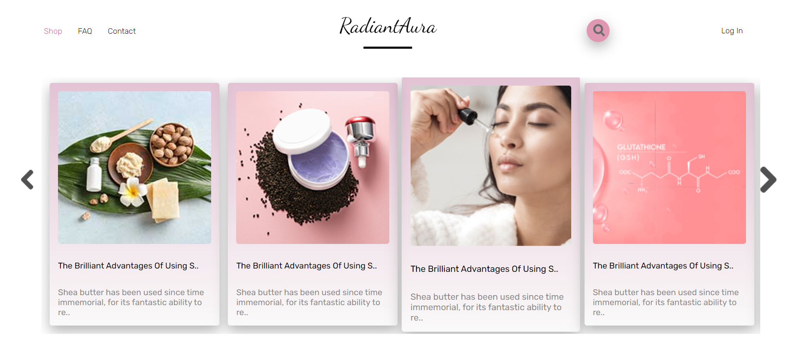
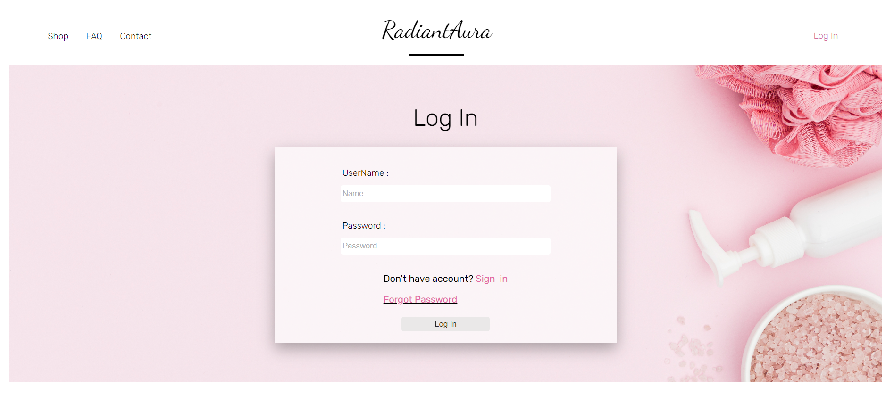
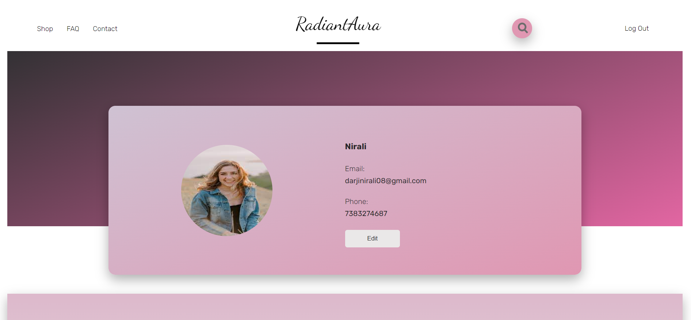
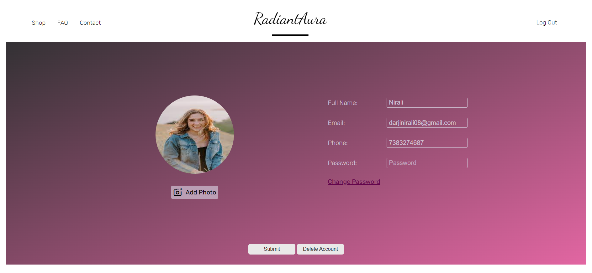
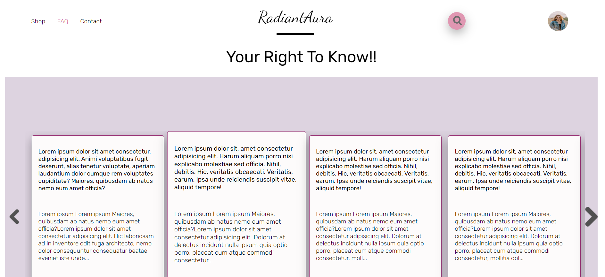

<div align='center'>

<h1>A Skin Care Web Application</h1>
<p>RadiantAura is a dynamic web application designed to enhance user experience through personalized profiles and secure authentication processes. Users can create accounts, log in securely, and update their profiles with ease. The platform implements email verification via OTP to ensure account security and authenticity. All user data, is stored in a database, guaranteeing privacy and confidentiality - HTML, CSS, JavaScript, Node JS, expressJS, mongoDB.</p>

<h4> <span> · </span> <a href="https://github.com/Nirali200/RadiantAura/blob/master/README.md"> Documentation </a> <span> · </span> <a href="https://github.com/Nirali200/RadiantAura/issues"> Report Bug </a> <span> · </span> <a href="https://github.com/Nirali200/RadiantAura/issues"> Request Feature </a> </h4>


</div>

# :notebook_with_decorative_cover: Table of Contents

- [About the Project](#star2-about-the-project)
- [Contact](#handshake-contact)


## :star2: About the Project

### :dart: Features
- User Authentication: Secure user authentication with JWT and bcrypt.
- Product Recommendations: product suggestions.
- File Uploads: Users can upload profile image using multer.
- File Uploads: Users can upload images for analysis using multer.

## Sneak Peek of Site 🙈 :








### :key: Environment Variables
To run this project, you will need to add the following environment variables to your .env file
`PORT=3000`

`CONNECTION_STRING =your_mongodb_connection_string`

`SECRET_STRING=your_jwt_secret`

`SMTP_PASS =your_email_password`

`SMTP_USER =your_email_address`

### 🤌: Dependencies
`bcrypt: ^5.1.1`

`body-parser: ^1.20.2`

`cookie-parser: ^1.4.6`

`dotenv: ^16.4.5`

`ejs: ^3.1.9`

`express: ^4.18.2`

`fs: ^0.0.1-security`

`jsonwebtoken: ^9.0.2`

`mongoose: ^8.4.0`

`multer: ^1.4.5-lts.1`

`nodemailer: ^6.9.10`

`nodemon: ^3.1.1`

`path: ^0.12.7`

`url: ^0.11.3`

## :toolbox: Getting Started

### :bangbang: Prerequisites

- Install Node JS in your computer


### :gear: Installation

nodemodual
```bash
npm install
```


### :test_tube: Running Tests

Run the application:
```bash
npm run dev
```


### :running: Run Locally

Clone the project

```bash
https://github.com/Nirali200/RadiantAura
```


## :handshake: Contact

Nirali Darji - - darjinirali08@gmail.com

Live Project Link: [https://radiantaura.onrender.com/](https://radiantaura.onrender.com/)
